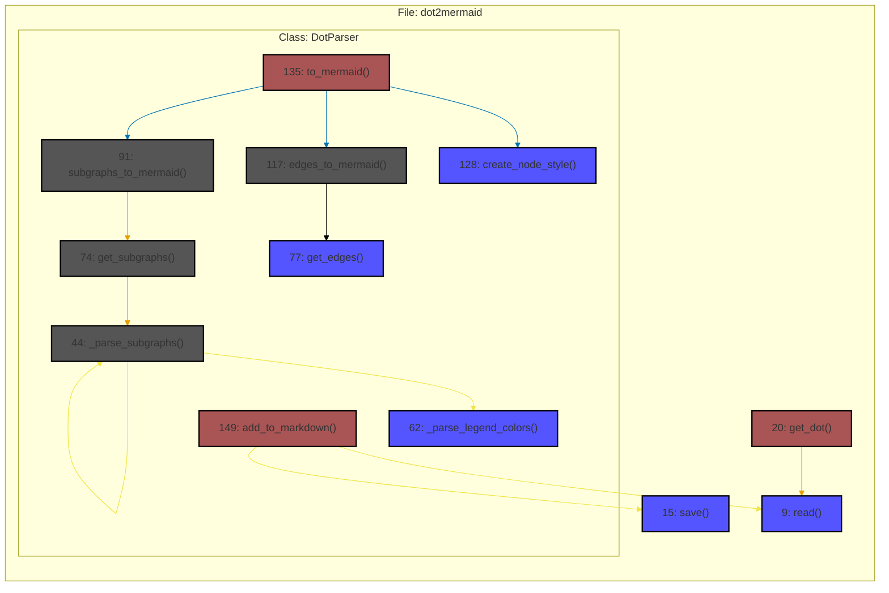

# dot2mermaid

A library that convers .dot file to mermaid and markdown.

Requirements:

- graphviz
- code2flow
- pygraphviz

Windows users should install pygraphviz after graphviz by:
```bash
py -m pip install --use-pep517 --config-settings="--global-option=build_ext"  --config-settings="--global-option=-IC:\Program Files\Graphviz\include"  --config-settings="--global-option=-LC:\Program Files\Graphviz\lib" pygraphviz
```

After proper installation, try:

```python
from dot2mermaid import DotParser, get_dot

path = "./path/to/your/code/directory"
dot_file = get_dot(path)
parser = DotParser(dot_file)
colors = {
    'regular': '#555555',
    'trunk': '#AA5555',
    'leaf': '#5555FF'
}
markdown_content = parser.to_mermaid(colors=colors)
parser.add_to_markdown('./README.md', markdown_content)  # to replace mermaid
```



Compare it with code2flow png file:

